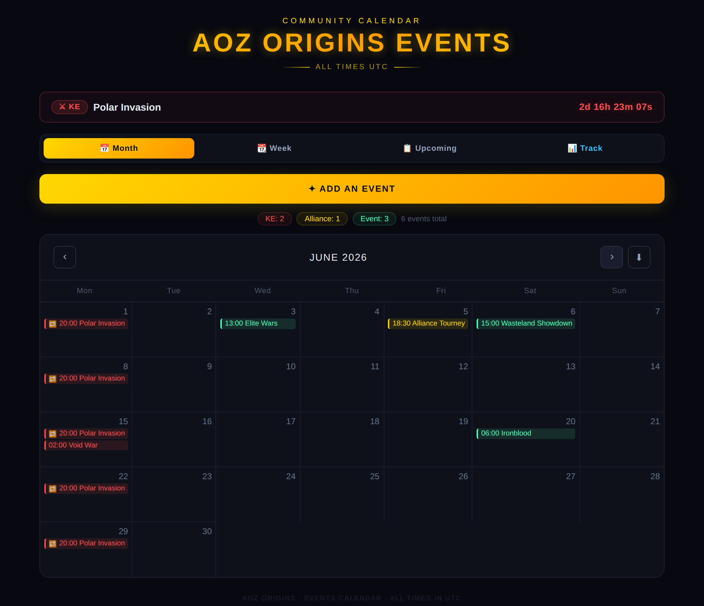
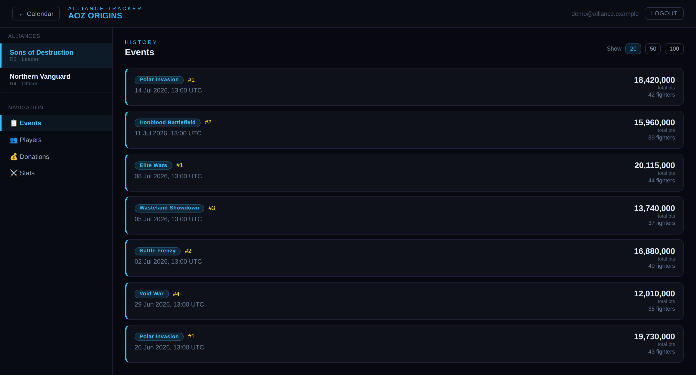
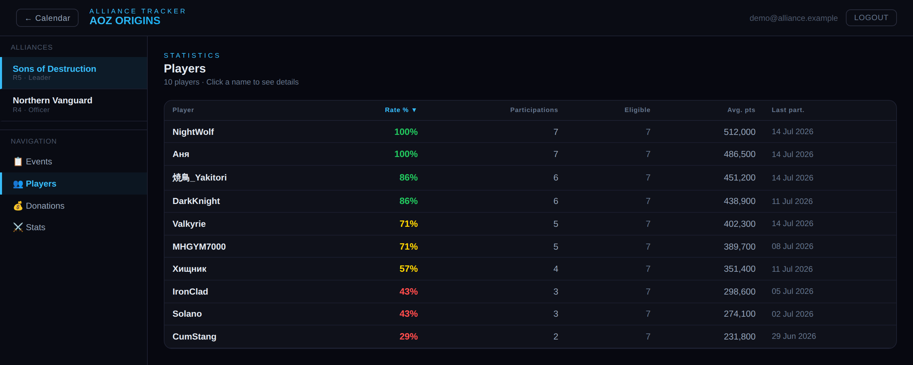
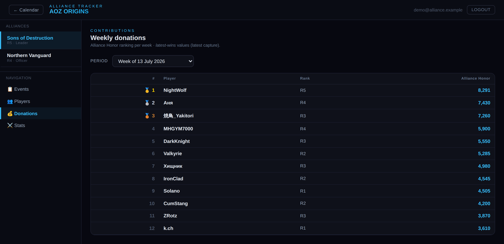
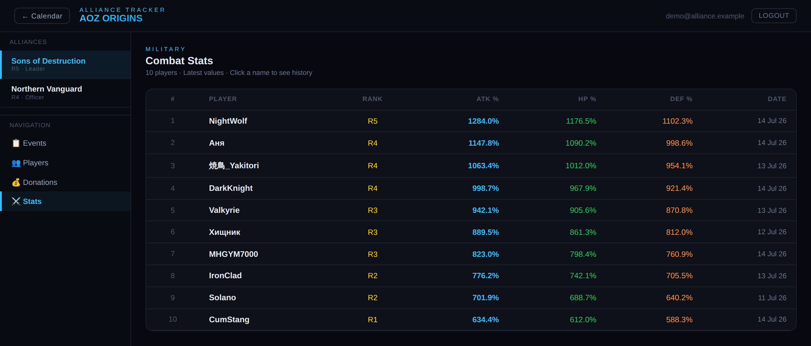

# AOZ Alliance Starter

[](https://github.com/j2xr/aoz-alliance-starter/actions/workflows/tracker.yml)
[](https://github.com/j2xr/aoz-alliance-starter/actions/workflows/frontend.yml)
[](LICENSE)

A clone-and-go template for running an **alliance management + events** stack
for the mobile game *Age of Z Origins*. It bundles an event calendar, a
read-only tracking dashboard, and an automated screenshot-to-database pipeline
so you can stand up the whole thing for your own alliance from scratch.

> **Use this template → fill in two services' worth of secrets → deploy.**
> Everything runs on free tiers (Supabase + Vercel) plus one small Docker host
> for the bot.



---

## What's inside

```
aoz-alliance-starter/
├── frontend/    React + Vite app — event calendar + /tracking dashboard
├── tracker/     Discord bot + OCR service that populate the at_* tables
├── supabase/    SQL migrations (events + at_*) — one shared project
└── docs/        SETUP.md (start here), ARCHITECTURE.md, screenshots
```

- **frontend/** — a public event calendar (month / week / upcoming views, ICS &
  Google Calendar export, recurring events, all in UTC) backed by a Supabase
  `events` table, plus a login-gated `/tracking` dashboard that reads the
  alliance stats (`at_*` tables) produced by the tracker.
- **tracker/** — a Discord bot that watches your alliance channels, and a Python
  OCR service that turns posted game screenshots into structured rows
  (events, participations, donations, military stats).
- **supabase/** — all the database migrations, merged so a single
  `supabase db push` builds the whole schema on a fresh project.

## How it works

```
 In-game screenshot           Discord bot            OCR service            Supabase
 (posted to a channel)  ──▶   catches upload   ──▶   Tesseract + parsers  ──▶  at_* tables
                                                       (per event type)          │
                                                                                 ▼
                                                              /tracking dashboard reads it back
```

A member drops a screenshot in a watched Discord channel; the bot forwards it to
the OCR service, which detects the screen type (event leaderboard, donation
ranking, or player stats chat), extracts the rows, and upserts them into
Supabase. The frontend dashboard then renders the history — no manual data entry.

## The tracking dashboard

Login-gated at `/tracking`, scoped per alliance. Members see only the alliances
they belong to; everything is read-only.

| Page | What it shows |
|------|---------------|
| 📋 **Events** | Per-event leaderboards (rank, power, points) with participation history |
| 👥 **Players** | Roster with per-player participation rate and power/points evolution |
| 💰 **Donations** | Weekly Alliance Honor ranking, one selectable week at a time |
| ⚔️ **Stats** | Latest military stats (attack / HP / defense %) per member, with history |

**Events** — every recorded event with its alliance rank, total points and fighter count:



**Players** — per-member participation rate (colour-coded), participations and average points:



**Donations** — weekly Alliance Honor ranking, latest capture wins:



**Stats** — latest attack / HP / defense percentages per member:



> The tracking screenshots above use example alliance data for illustration.

## Stack

| Layer | Tech |
|-------|------|
| Frontend | React 18, Vite 5, React Router 7, TanStack Query, Recharts |
| Database | Supabase (Postgres + RLS + realtime) |
| Frontend hosting | Vercel |
| Discord bot | Node.js 20, discord.js v14 |
| OCR service | Python 3.12, FastAPI, OpenCV, Tesseract |
| Deployment (tracker) | Docker Compose (Railway / Fly.io also work) |

---

## Getting started

**→ Follow [`docs/SETUP.md`](docs/SETUP.md)** for the full step-by-step walkthrough:
create a Supabase project, push the schema, create a Discord app, configure the
two `.env` files, deploy the frontend to Vercel, and run the tracker.

For how the pieces fit together, see [`docs/ARCHITECTURE.md`](docs/ARCHITECTURE.md).

---

## Credits

Built from two source projects by [@j2xr](https://github.com/j2xr) — an event
calendar frontend and an alliance tracker backend — genericised here into a
reusable, self-hostable template.

## License

[MIT](LICENSE)
