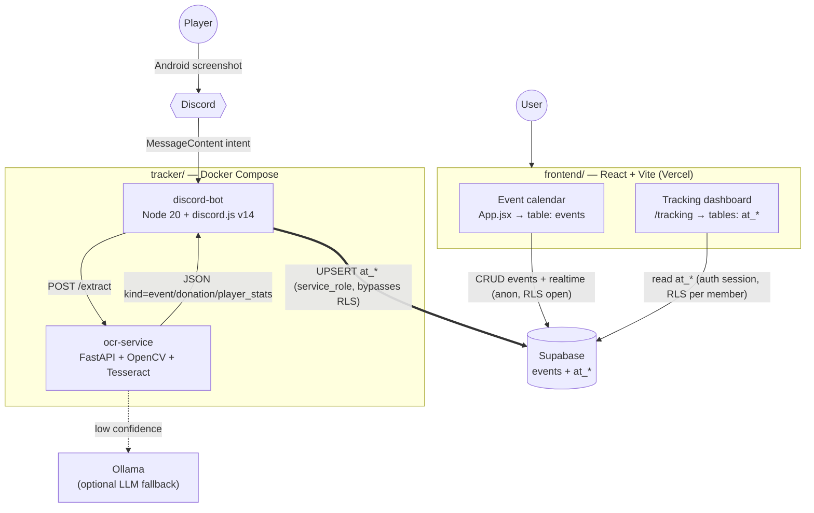

# Architecture

Three pieces share **one** Supabase project:

- **frontend/** — React + Vite app on Vercel. Owns the public `events` table
  (calendar) and reads the `at_*` tables (tracking dashboard).
- **tracker/** — Discord bot + OCR service in Docker. Owns and writes the `at_*`
  tables from game screenshots.
- **supabase/** — the migrations that define both halves of the schema.

The only coupling between frontend and tracker is the shared database. There is
no shared code and no direct network call between them.

## Data ownership

| Table(s) | Owner | Access from frontend |
|----------|-------|----------------------|
| `events` | frontend | public read/write, RLS open (no login) |
| `at_*` | tracker | read-only, RLS active, scoped per member via `at_alliance_members` |

- The **bot** writes `at_*` with the Supabase **service role key**, which
  bypasses RLS. This key lives only in the tracker's server-side `.env` — never
  in the browser.
- The **dashboard** reads `at_*` with the **anon key** plus a logged-in user
  session. RLS (migration `0017`) limits each user to the alliances they belong
  to, via rows in `at_alliance_members`.

## Request/data flow

1. A player posts a game screenshot in a Discord channel that maps to an
   alliance (`at_alliances.discord_channel_id`).
2. The bot deduplicates by sha256, then calls the OCR service `POST /extract`.
3. The OCR service classifies the screen (`event`, `donation`, or
   `player_stats`), extracts the fields deterministically with Tesseract, and
   returns JSON. Low-confidence player names can optionally be re-read by a
   local Ollama vision model.
4. The bot UPSERTs the result into the relevant `at_*` tables (idempotent —
   re-uploading the same capture is a no-op).
5. The dashboard reads those tables through Supabase with RLS applied.

## Conventions

- **UTC everywhere** — database, UI, and logs all use UTC.
- **`at_` prefix** — every object the tracker creates (tables, views `at_v_*`,
  indexes, policies) is prefixed `at_`. The unprefixed `events` table belongs to
  the frontend. Nothing drops or alters unprefixed objects.
