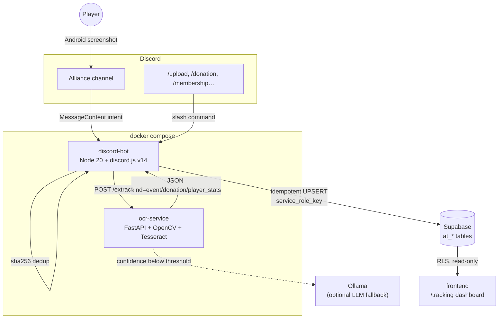

# tracker — Discord bot + OCR service

Backend that automatically ingests an *Age of Z Origins* alliance's activity
from Android screenshots posted in Discord, and writes the results to Supabase
(`at_*` tables). The web dashboard that reads those tables lives in
[`../frontend`](../frontend).

Two Docker services:

- **`discord-bot`** (Node.js 20, discord.js v14) — watches the alliance
  channels, deduplicates screenshots by sha256 hash, calls the OCR service,
  then UPSERTs the results into Supabase.
- **`ocr-service`** (Python 3.12, FastAPI, OpenCV, Tesseract) — deterministic
  field extraction (power, points, donations, military stats, player names)
  with an optional local LLM fallback via Ollama.

> All times are stored and processed in **UTC**.

---

## Architecture



---

## Layout

```
tracker/
├── apps/
│   ├── discord-bot/   # Node.js 20 + discord.js v14
│   └── ocr-service/   # Python 3.12 + FastAPI + OpenCV + Tesseract
├── packages/
│   └── shared-types/  # shared TS types
├── tools/
│   ├── bench-ocr/     # OCR benchmark fixtures + script
│   └── sql/           # utility SQL scripts
└── docker-compose.yml
```

The Supabase migrations are **not** here — they live one level up in
[`../supabase/migrations`](../supabase/migrations), shared with the frontend.

---

## Quick start (Docker)

```bash
cp apps/discord-bot/.env.example apps/discord-bot/.env
cp apps/ocr-service/.env.example apps/ocr-service/.env
# fill in the secrets, then:
docker compose up --build -d
docker compose logs -f discord-bot
```

See the repo-root [`docs/SETUP.md`](../docs/SETUP.md) for the full end-to-end
walkthrough (Supabase, Discord app, env vars, first login).

---

## Local development (without Docker)

Prerequisites: `pnpm` (>=9), `uv` (Python package manager), Tesseract with the
`rus`/`jpn`/`chi_sim`/`vie`/`kor` language packs.

```bash
# OCR service
cd apps/ocr-service
uv sync
uv run uvicorn app.main:app --reload
uv run pytest

# Discord bot
pnpm install
pnpm --filter @alliance-tracker/discord-bot dev
pnpm --filter @alliance-tracker/discord-bot test
```

---

## Data model

| Domain | Main tables |
|--------|-------------|
| Identities | `at_alliances`, `at_players`, `at_alliance_memberships`, `at_player_aliases` |
| Events | `at_event_types`, `at_events`, `at_participations` |
| Donations | `at_donation_periods`, `at_donations` |
| Military stats | `at_player_stats` |
| Pipeline | `at_screenshot_uploads` (sha256 dedup) |
| Views | `at_v_event_leaderboard`, `at_v_player_participation_rate`, `at_v_donation_leaderboard`, `at_v_player_stats_latest`, … |

All writes go through idempotent UPSERTs. Re-uploading the same screenshot is a
no-op; re-uploading for the same period overwrites (latest-wins for donations
and stats).

Every object this backend creates is prefixed `at_` — the frontend owns the
unprefixed `events` table in the same Supabase project.

---

## Recognised screen types

| `kind` | Trigger (header) | Tables written |
|--------|------------------|----------------|
| `event` | Title in `_TITLE_PATTERNS` (Polar Invasion, Elite Wars…) | `at_events`, `at_participations` |
| `donation` | "Contribution Ranking" | `at_donation_periods`, `at_donations` |
| `player_stats` | "city stats" | `at_player_stats` |

Ambiguous detection → force it with `/upload kind:<event|donation|player_stats>`.

---

## Discord commands

| Command | Effect |
|---------|--------|
| `/upload kind:<type>` | Force the type if auto-detection fails |
| `/event list` | Latest events for the alliance |
| `/player <name>` | Player card (participation rate, history) |
| `/leaderboard` | Leaderboard for an event |
| `/reprocess <message_url>` | Re-run a single screenshot |
| `/reprocess-channel` | Re-run every screenshot in a channel |
| `/membership <player> <joined\|left>` | Manually mark a join/leave |
| `/donation leaderboard` | Top contributors of the week |
| `/donation player <name>` | A player's donation history |
| `/donation list` | Recorded donation periods |
| `/player-alias` | Manage a player's OCR aliases |
| `/merge` | Merge two duplicate players |

Automatic ingestion fires on any message with an attachment in a channel listed
in `DISCORD_ALLOWED_CHANNEL_IDS`.
