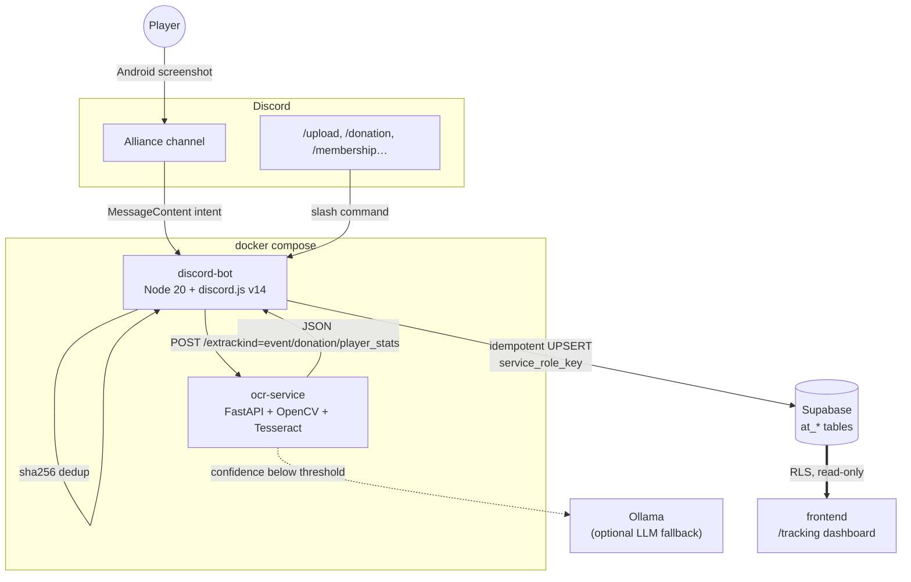

# tracker — Discord bot + OCR service

Backend that automatically ingests an *Age of Z Origins* alliance's activity
from Android screenshots posted in Discord, and writes the results to Supabase
(`at_*` tables). The web dashboard that reads those tables lives in
[`../frontend`](../frontend).

Two Docker services:

- **`discord-bot`** (Node.js 20, discord.js v14) — watches the alliance
  channels, deduplicates screenshots by sha256 hash, calls the OCR service,
  then UPSERTs the results into Supabase.
- **`ocr-service`** (Python 3.12, FastAPI, OpenCV, Tesseract) — deterministic
  field extraction (power, points, donations, military stats, player names)
  with an optional local LLM fallback via Ollama.

> All times are stored and processed in **UTC**.

---

## Architecture


```mermaid
graph TB
    Player((Player))

    subgraph DiscordSide["Discord"]
        Channel["Alliance channel"]
        Cmds["/upload, /donation, /membership…"]
    end

    subgraph Docker["docker compose"]
        Bot["discord-bot<br/>Node 20 + discord.js v14"]
        OCR["ocr-service<br/>FastAPI + OpenCV + Tesseract"]
    end

    Ollama["Ollama<br/>(optional LLM fallback)"]
    Supabase[(Supabase<br/>at_* tables)]
    Dashboard["frontend<br/>/tracking dashboard"]

    Player -->|Android screenshot| Channel
    Channel -->|MessageContent intent| Bot
    Cmds -->|slash command| Bot

    Bot -->|sha256 dedup| Bot
    Bot -->|POST /extract| OCR
    OCR -->|JSON kind=event/donation/player_stats| Bot
    OCR -.->|confidence below threshold| Ollama

    Bot -->|idempotent UPSERT<br/>service_role_key| Supabase
    Supabase ==>|RLS, read-only| Dashboard
```

---

## Layout

```
tracker/
├── apps/
│   ├── discord-bot/   # Node.js 20 + discord.js v14
│   └── ocr-service/   # Python 3.12 + FastAPI + OpenCV + Tesseract
├── packages/
│   └── shared-types/  # shared TS types
├── tools/
│   ├── bench-ocr/     # OCR benchmark fixtures + script
│   └── sql/           # utility SQL scripts
└── docker-compose.yml
```

The Supabase migrations are **not** here — they live one level up in
[`../supabase/migrations`](../supabase/migrations), shared with the frontend.

---

## Quick start (Docker)

```bash
cp apps/discord-bot/.env.example apps/discord-bot/.env
cp apps/ocr-service/.env.example apps/ocr-service/.env
# fill in the secrets, then:
docker compose up --build -d
docker compose logs -f discord-bot
```

See the repo-root [`docs/SETUP.md`](../docs/SETUP.md) for the full end-to-end
walkthrough (Supabase, Discord app, env vars, first login).

---

## Local development (without Docker)

Prerequisites: `pnpm` (>=9), `uv` (Python package manager), Tesseract with the
`rus`/`jpn`/`chi_sim`/`vie`/`kor` language packs.

```bash
# OCR service
cd apps/ocr-service
uv sync
uv run uvicorn app.main:app --reload
uv run pytest

# Discord bot
pnpm install
pnpm --filter @alliance-tracker/discord-bot dev
pnpm --filter @alliance-tracker/discord-bot test
```

---

## Data model

| Domain | Main tables |
|--------|-------------|
| Identities | `at_alliances`, `at_players`, `at_alliance_memberships`, `at_player_aliases` |
| Events | `at_event_types`, `at_events`, `at_participations` |
| Donations | `at_donation_periods`, `at_donations` |
| Military stats | `at_player_stats` |
| Corrections | `at_corrections` (audit log of manual `/correct` fixes) |
| Pipeline | `at_screenshot_uploads` (sha256 dedup) |
| Views | `at_v_event_leaderboard`, `at_v_player_participation_rate`, `at_v_donation_leaderboard`, `at_v_donation_player_totals`, `at_v_player_stats_latest`, `at_v_player_stats_history`, `at_v_probable_leavers`, `at_v_event_import_delta`, `at_v_needs_review` |

All writes go through idempotent UPSERTs. Re-uploading the same screenshot is a
no-op; re-uploading for the same period overwrites (latest-wins for donations
and stats).

Every object this backend creates is prefixed `at_` — the frontend owns the
unprefixed `events` table in the same Supabase project.

---

## Recognised screen types

| `kind` | Trigger (header) | Tables written |
|--------|------------------|----------------|
| `event` | Title in `_TITLE_PATTERNS` (Polar Invasion, Elite Wars…) | `at_events`, `at_participations` |
| `donation` | "Contribution Ranking" | `at_donation_periods`, `at_donations` |
| `player_stats` | "city stats" | `at_player_stats` |

Ambiguous detection → force it with `/upload kind:<event|donation|player_stats>`.

---

## Feeding the tracker (what to screenshot)

Post the in-game screenshot to a Discord channel listed in
`DISCORD_ALLOWED_CHANNEL_IDS` and the bot ingests it automatically. What to
capture for each screen:

- **Events** — the event's leaderboard screen. Detected by its title (Polar
  Invasion, Elite Wars, …). Writes `at_events` + `at_participations`.
- **Donations** — the **Contribution Ranking** screen. Writes
  `at_donation_periods` + `at_donations`.
- **Attack / HP / Defense stats** — a screenshot of the in-game **"(LOL) City
  stats" chat**, where members type their military percentages in free-form
  messages. Detected by the channel title containing **"city stats"**; the
  parser reads whatever labels appear — LRA/MRA (attack), MHP/HP/PV (HP), MGD
  (defense), OCR-misread variants included — and writes `at_player_stats` (one
  row per player per day, latest wins). It surfaces on the ⚔️ Stats dashboard
  page.

If auto-detection guesses wrong, force the type with
`/upload kind:<event|donation|player_stats>`.

---

## OCR quality & corrections

Reading game screenshots is imperfect, so the pipeline defends data quality at
three points:

1. **At extraction** — `validators.py` applies sanity rules (power ≥ 1M, rank
   `R1`–`R5`, and it auto-repairs a swapped power/points pair), `base.py` flags a
   `possible_truncation`, and a page is rejected outright if fewer than half its
   rows read cleanly. Low-confidence player names can optionally be re-read by a
   local LLM (`LLM_FALLBACK_ENABLED`); the confidence thresholds are env vars
   (`OCR_CONFIDENCE_THRESHOLD*`, see [`docs/SETUP.md`](../docs/SETUP.md)).
2. **At storage** — names are matched against known aliases
   (`at_player_aliases`), and a close fuzzy match is auto-saved as a new alias,
   so the system keeps learning. A row read below the confidence threshold is
   stored anyway but flagged `needs_review`.
3. **After the fact** — the dashboard's 🔍 **Review** page (`at_v_needs_review`)
   lists every flagged row worst-first, and a per-event **import-completeness**
   check (`at_v_event_import_delta`) compares the game's own header totals against
   the imported rows. Fix a value with `/correct` (audited in `at_corrections`),
   map a misread name with `/player-alias`, or merge duplicate players with
   `/merge`.

**Caveat on the import check:** the completeness verdict uses the **row count**
only (`total_battlers` vs imported rows). `total_points` is *not* the sum of
member points for every event type — for Elite Wars, Polar Invasion and
Wasteland Showdown the header figure is a different, alliance-level metric
(measured 259×, 19.7× and 24.4× the member sum), so the view exposes both point
totals as raw context and computes no points delta.

---

## Discord commands

| Command | Effect |
|---------|--------|
| `/upload kind:<type>` | Force the type if auto-detection fails |
| `/event list` | Latest events for the alliance |
| `/player <name>` | Player card (participation rate, history) |
| `/leaderboard` | Leaderboard for an event |
| `/reprocess <message_url>` | Re-run a single screenshot |
| `/reprocess-channel` | Re-run every screenshot in a channel |
| `/membership <player> <joined\|left>` | Manually mark a join/leave |
| `/donation leaderboard` | Top contributors of the week |
| `/donation player <name>` | A player's donation history |
| `/donation list` | Recorded donation periods |
| `/player-alias` | Manage a player's OCR aliases |
| `/merge` | Merge two duplicate players |
| `/correct` | Manually correct a score misread by OCR (audited in `at_corrections`) |
| `/find-duplicates` | List likely duplicate players (read-only, no merging) |
| `/setup-alliance` | Create the alliance linked to this Discord channel |

Automatic ingestion fires on any message with an attachment in a channel listed
in `DISCORD_ALLOWED_CHANNEL_IDS`.
